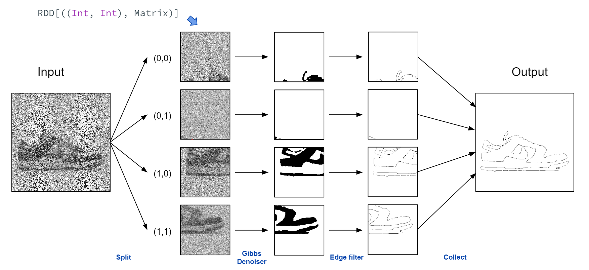
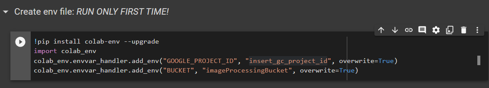
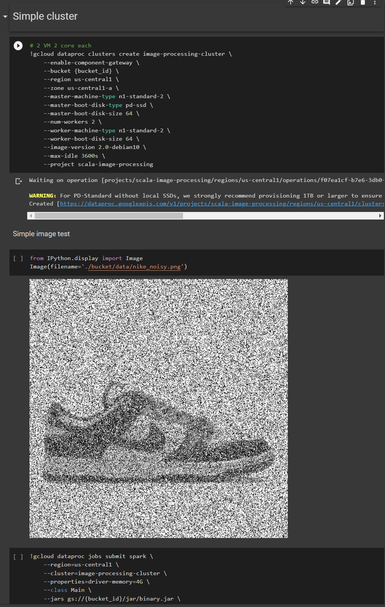
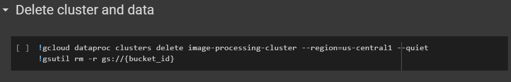
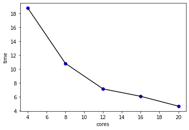
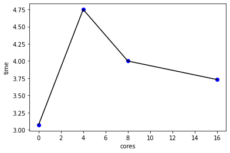
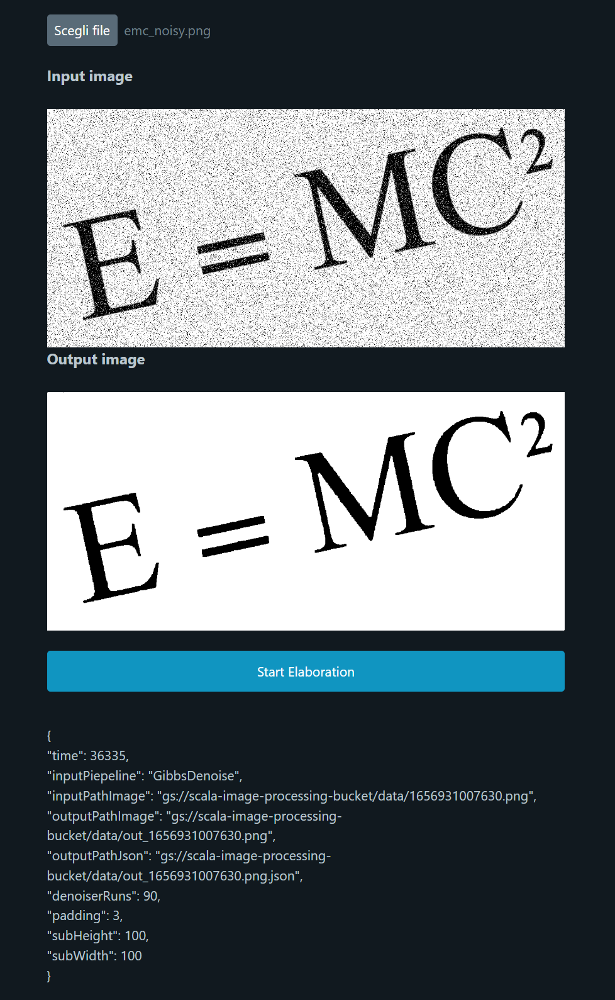

# Image processing using a Spark cluster
This project aims to be a parallel and distributed implementation of the Gibbs denoiser algorithm. Later, more algorithms for image processing based on the convolution method were added. Other implementations can be added extending the <code>Algorithm</code> trait and providing a pipeline for that.

The Gibbs sampling algorithm details are showed in the following [paper](http://stanford.edu/class/ee367/Winter2018/yue_ee367_win18_report.pdf).

### Processing pipeline
The program get the image that you want to process and split it into smaller chunks. Each sub-image, and its corresponding position, is pushed into a RDD (Resilient Distributed Dataset) and then processed by a Spark worker.

Multiple operations can be performed on the same chunk, these can be implemented exenting the <code>Pipeline</code> class and setting all the tasks needed. Tasks can also be implemented by extending the <code>Algorithm</code> trait.

By deafult these pipelines are implemented:
- **GibbsDenoiser**, applies a Gibbs denoiser task
- **MedianDenoiser**, applies two median filters
- **GibbsEdgeDetection**, applies a Gibbs denoiser task and the an edge detection kernel
- **EdgeDetection**, aplies a kernel to detect edges and then inverts th image

In the last stage al the processed sub-images are collected and the image is returned.

#### Example of a pipeline:


### Make your own tasks and pipelines

You can implement your own image processing tasks by extending the <code>Algorithm</code> trait and implementing the <code>run</code> method. It takes an unprocessed image matrix and outputs the processed one.
```scala
object YourOwnPipelineAlgorithm extends Algorithm {
    
    /**
    * Main method, takes a matrix and return a matrix
    *
    * @param imageMatrix unprocessed image matrix
    * @return processed image matrix
    */
    def run (imageMatrix :DenseMatrix[Double]): DenseMatrix[Double] {...}
}
```
If you want to create your custom pipeline you can extend the <code>Pipeline</code> class and then call the constructor with a list of all the tasks.
```scala
object YourOwnPipeline extends Pipeline (
    List(
        YourOwnTask,
        YourOwnTask
    )) {}
```

### Run on a local Spark cluster
The program takes some parameters as input:
```bash
Usage: [--debug] [--padding] [--sub_matrix_size] [--pipeline] [--denoiser_runs] [--output_file_json] [--output_file_image] input_file_image
```

|Param|Description|
|-|-|
|--debug|Enable debug prints (enable by default = 1 ) |
|--padding|How many padding pixels to use when splitting the image|
|--sub_matrix_size|Size of sub-matrixes|
|--pipeline|Set the pipeline type|
|--denoiser_runs|Gibbs denoiser runs (only for pipelines that use this)|
|--output_file_json| Path to report file|
|--output_file_image|Path to output image|

Software requirements:
* sbt >= 1.6.1
* Spark >= 3.2.1

#### Shell commands:
```bash
|> sbt assembly
|> spark-submit --driver-memory 8g --master local[*]  ./jar/binary.jar ./data/nike_noisy.png
```
If the program crashes on the collect phase, especially on big images, it is due to insufficient memory on the spark driver. You can change the driver memory settings using the param <code>--driver-memory</code>.

### Google Cloud setup
For convenience all gcloud commands (Google Cloud SDK) are written in a Colab notebook that is in the root of this repo. Nothing prohibits you from taking them separately and running them on other machines.

To run the program on the Google Cloud platform you have to create a new project and enable the following services:
* **Dataproc**
* **Cloud Storage**

And if you haven't done it yet you have to enable billing for the project.

The first step is to do the setup of the notebook environment variables. You will be asked to enable access to your Google Drive and Google credentials.



Then you need to fill the file that is created in the root of your google drive with your project id and the name you want to give the bucket.

Finally run all the cells in *Setup environment*, this will create a new bucket and all the the *./data* files are copied into it. It also create a new directory (*./bucket*) on the Colab runtime that is directly binded to the cloud storage bucket.

#### Simple job
To run a simple cluster with 2 workers (8 core) execute the cell *Simple cluster*. You can change the commands parameters to meet your needs.



#### Delete resources
To delete all resources allocated by the cluster and also all the bucket content, you can run the cell *Delete cluster and data*.


### Performance tests
There are also tests in the notebook to evaluate the performance of the cluster.
#### Strong scalability
In this test we want to see how the execution time changes by keeping the workload fixed and increasing the number of computational resources.

**REMEMBER TO DO THIS** to avoid paying for what you are not using.

Cluster setup:
* Master machine N1, 16GB RAM, 4 cores, SSD boot drive
* Worker machine N1, 8GB RAM, 4 cores

Runs:
* 1 worker, 4 cores, 8k test image
* 2 workers, 8 cores, 8k test image
* 3 workers, 12 cores, 8k test image
* 4 workers, 16 cores, 8k test image
* 5 workers, 20 cores, 8k test image



As you can see by doubling the number of cores the execution time is reduced by about half each time.

#### Weak scalability
In this test we want to see how the system reacts by doubling the workload and doubling the available computational resources.

Cluster setup:
* Master machine N1, 16GB RAM, 4 cores, SSD boot drive
* Worker machine N1, 8GB RAM, 4 cores

Runs:
* 1 worker, 2 cores, 2x 2k image
* 1 worker, 4 cores, 4k image
* 2 workers, 8 cores, 2x 4k image
* 4 workers, 16 cores, 8k image



As you can see the execution is always around 4 minutes.

### Web interface
There is also a web interface that you can use by creating a cluster and running the *Web interface* cell.



Remember to **DELETE THE CLUSTER** when you have done.